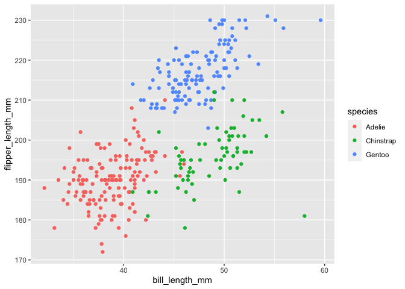

Data Science HW1
================
Akanksha Nalatwad

``` r
library(tidyverse)
```

    ## ── Attaching packages ─────────────────────────────────────────────────────────────────────────────────────────────── tidyverse 1.3.0 ──

    ## ✓ ggplot2 3.3.2     ✓ purrr   0.3.4
    ## ✓ tibble  3.0.3     ✓ dplyr   1.0.2
    ## ✓ tidyr   1.1.2     ✓ stringr 1.4.0
    ## ✓ readr   1.3.1     ✓ forcats 0.5.0

    ## ── Conflicts ────────────────────────────────────────────────────────────────────────────────────────────────── tidyverse_conflicts() ──
    ## x dplyr::filter() masks stats::filter()
    ## x dplyr::lag()    masks stats::lag()

## Problem 1

Create a data frame comprised of:

  - a random sample of size 10 from a standard Normal distribution
  - a logical vector indicating whether elements of the sample are
    greater than 0
  - a character vector of length 10
  - a factor vector of length 10, with 3 different factor “levels”

<!-- end list -->

``` r
prob1_df = 
  tibble(
    samp = rnorm(10),
    samp_gt_0 = samp > 0,
    char_vec = c("a", "b", "c", "d", "e", "f", "g", "h", "i", "j"),
    factor_vec = factor(c("low", "low", "low", "med", "med", "med", "med", "high", "high", "high"))
  )
```

Take the mean of each variable in my data frame.

``` r
mean(pull(prob1_df, samp))
```

    ## [1] -0.03511209

``` r
mean(pull(prob1_df, samp_gt_0))
```

    ## [1] 0.6

``` r
mean(pull(prob1_df, char_vec))
```

    ## Warning in mean.default(pull(prob1_df, char_vec)): argument is not numeric or
    ## logical: returning NA

    ## [1] NA

``` r
mean(pull(prob1_df, factor_vec))
```

    ## Warning in mean.default(pull(prob1_df, factor_vec)): argument is not numeric or
    ## logical: returning NA

    ## [1] NA

``` r
as.numeric(pull(prob1_df, samp))
```

    ##  [1] -2.60164008  0.18580959  0.45071117  0.84553085 -0.35548663 -0.91498447
    ##  [7]  1.91898302  0.07360285  1.05661904 -1.01026618

``` r
as.numeric(pull(prob1_df, samp_gt_0))
```

    ##  [1] 0 1 1 1 0 0 1 1 1 0

``` r
as.numeric(pull(prob1_df, char_vec))
```

    ## Warning: NAs introduced by coercion

    ##  [1] NA NA NA NA NA NA NA NA NA NA

``` r
as.numeric(pull(prob1_df, factor_vec))
```

    ##  [1] 2 2 2 3 3 3 3 1 1 1

``` r
as.numeric(pull(prob1_df, samp_gt_0)) * pull(prob1_df, samp)
```

    ##  [1] 0.00000000 0.18580959 0.45071117 0.84553085 0.00000000 0.00000000
    ##  [7] 1.91898302 0.07360285 1.05661904 0.00000000

## Problem 2

``` r
data("penguins", package = "palmerpenguins")
```

There are 344 rows and 8 columns in this dataset. The species in this
dataset include Adelie, Gentoo, Chinstrap and the islands include
Torgersen, Biscoe, Dream. The variable names in the dataset ‘penguins’
are: species, island, bill\_length\_mm, bill\_depth\_mm,
flipper\_length\_mm, body\_mass\_g, sex, year. The mean flipper length
in this data set is 200.9152047.

Scatterplot of Flipper length and Bill Length

``` r
ggplot(data=penguins, aes(x=bill_length_mm, y=flipper_length_mm, color=species))+geom_point()
```

    ## Warning: Removed 2 rows containing missing values (geom_point).

<!-- -->
